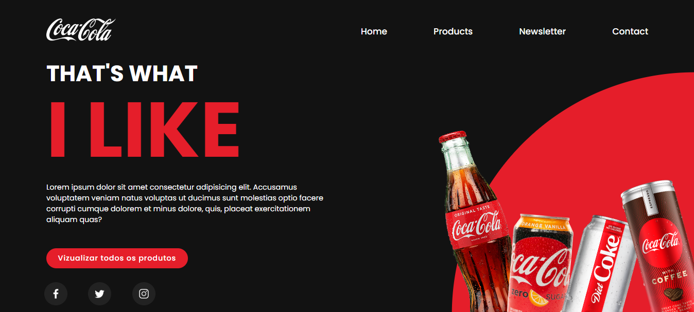

# Preview card 

## 📌 About ##
 

 Português:   
    Projeto de landing page da Coca-Cola, destacando-se pelos efeitos de mudança de cor e animações nos botões de redes sociais. Desenvolvido como um exercício para aprimorar habilidades em HTML e CSS.

English:  
    Coca-Cola landing page project, featuring captivating color-changing effects and animated social media buttons. Developed solely as a practice exercise to enhance skills in HTML and CSS.

## ⚒️ Tools 

- HTML5    
&nbsp;

- CSS3    
&nbsp;

## 💻 Preview <a href="https://pceraa.github.io/landingpag01/" target="_blank">🔗</a>

## 📃 License 

This project is under the MIT license. See the file [LICENSE](./LICENSE) for more details
